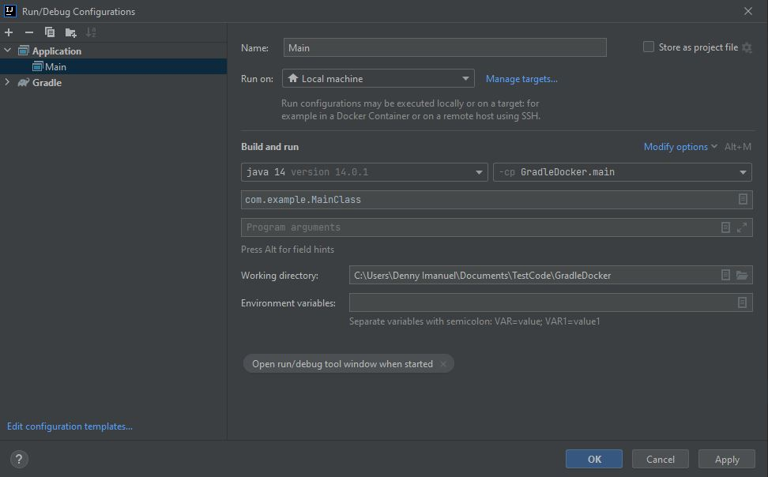
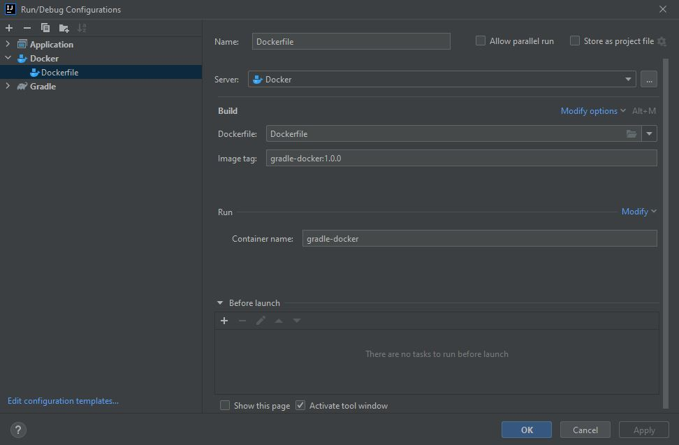
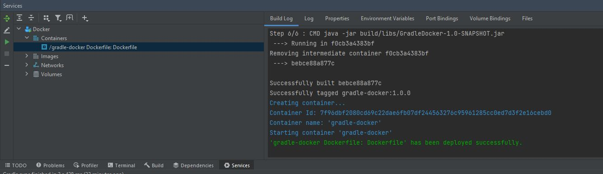

# Gradle Docker
by Denny Imanuel

This project shows how to dockerize Java console application that was built using Gradle configuration setup.

### Requirements

1. IntelliJ IDE - you need to install IntelliJ on your Windows machine
2. Docker Desktop - you need to install Docker Desktop for Windows
3. Open JDK - you need to install Open JDK and set JAVA_HOME env
4. Gradle - you need to install Gradle and set GRADLE_HOME env
5. JDK Image - you need to pull openjdk image from Docker Hub

### Run Configuration

On IntelliJ toolbar 'Edit Configuration' choose Application, and fill in below to run main app:

### Docker Configuration

On IntelliJ toolbar 'Edit Configuration' choose Docker > Dockerfile, and fill in below to run docker:

### Run Docker

And then Run 'Dockerfile' configuration, on 'Service' tab you'll see new container created

